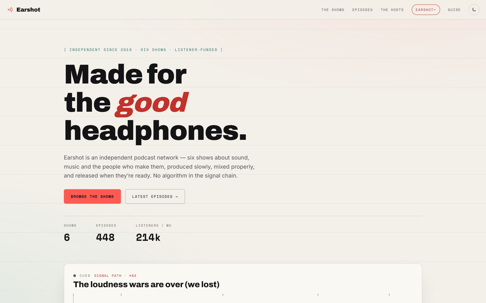

<!-- parable:beautified -->
<div align="center">

<h1>Earshot</h1>

<p><strong>Podcast network — scrub a rendered canvas waveform with a live playhead, then browse the episode timeline.</strong></p>

<p>
  <a href="https://bswxyz.github.io/earshot/"></a>
  
  
  <a href="LICENSE"></a>
</p>

<p>
  <a href="https://bswxyz.github.io/earshot/"><b>Live demo</b></a>
  &nbsp;·&nbsp;
  <a href="https://bswxyz.github.io/earshot/guide/">Build notes</a>
  &nbsp;·&nbsp;
  <a href="https://parable-three.vercel.app/templates">More templates</a>
</p>

<a href="https://bswxyz.github.io/earshot/">
  
</a>

</div>

**Use this template** — copy the source into a new project:

```bash
npx degit bswxyz/earshot my-app
```


A design-showcase website template by **Parable**. Earshot is a fictional listener-funded
podcast network — six shows about sound, music and the people who make them. The whole site
hangs on one object: a **seekable waveform deck** that behaves like a real player without
shipping a single audio file.

## Concept

Podcasts are invisible, so most network sites fall back on cover-art grids and app badges.
Earshot draws the sound instead:

- The hero is a **canvas waveform scrubber** — click/drag to seek, space to play, arrow keys
  to scrub. The transport is simulated in real time; an opt-in WebAudio "cue tone" lets you
  *hear* the wave's shape without any audio asset.
- The **broadcast log** (latest episodes) feeds the deck: "cue it up" on any episode loads its
  waveform, chapters and duration into the hero player.
- Hosts have **no headshots** — every portrait is the host's voiceprint, rendered as seeded SVG.

## Design system

| Token | Light ("paper sleeve") | Dark ("studio at night") |
| --- | --- | --- |
| `--bg` | `#f3f0e9` paper | `#141416` studio-ink |
| `--ink` | `#141416` | `#f3f0e9` |
| `--accent` | broadcast-coral `#ff5a52` (graphics) / `#c0322a` (text) | `#ff5a52` / `#ff756e` |
| `--teal` | `#14716a` (text) / `#2aa39a` (art) | `#43bcb2` / `#2aa39a` |
| `--ease-tape` | `cubic-bezier(.26,.88,.18,1)` — fast spool-up, long soft brake | same |

Type trio: **Archivo** (display, 800–900), **Inter** (body), **Space Mono** (meters:
timestamps, chapters, tags). Both themes ship complete; the toggle persists to
`localStorage["earshot-theme"]` and is applied inline in `<head>` before first paint.

## Stack

- **Next.js 14** (App Router) with `output: 'export'` — plain static HTML in `out/`
- React only where state earns it: the transport context, the deck, the timeline, the toggle
- **Zero media files** — canvas, inline SVG and CSS only; waveforms are procedural
  (seeded PRNG → deterministic per episode, identical on server and client)
- Google Fonts (Archivo / Inter / Space Mono) with preconnect

## Run locally

```bash
npm install
npm run dev     # serves at http://localhost:3000/earshot (note the basePath)
npm run build   # static export → out/
```

## Structure

```
app/
  layout.tsx        html shell: .js gate + theme bootstrap, fonts, fixed bg layers
  page.tsx          nav · hero (waveform deck) · shows · broadcast log · hosts · Earshot+ · footer
  guide/page.tsx    "How Earshot was built" — idea, stack, technique, deploy notes
  globals.css       design tokens (both themes) first, then everything else
components/
  WaveformPlayer.tsx  the signature flourish: canvas scrubber + simulated transport + cue tone
  TransportContext.tsx one transport shared by the deck and the timeline
  EpisodeTimeline.tsx  broadcast log with per-episode mini waveforms + cue buttons
  ShowArt.tsx / Voiceprint.tsx  deterministic inline-SVG art
  ThemeToggle.tsx / Reveal.tsx / Facts.tsx / SubscribeForm.tsx
lib/
  data.ts           shows, episodes, hosts + the procedural peaks model
  hooks.ts          useInView, useReducedMotion, useCountUp, the tape ease
```

## Demo vs. real

This is a design showcase, not a product:

- **The network is fiction.** Shows, hosts, episode counts, listener numbers and prices are
  invented (but internally consistent).
- **The player is simulated.** There is no audio file; the waveform is procedural and the
  transport advances in real time. The optional "cue tone" is a WebAudio oscillator, created
  only after you opt in.
- **The subscribe form sends nothing.** It validates and confirms in place, client-side only.
- **The "listen anywhere" platforms** in the footer are labels, not live directory links.

Accessibility notes: the scrubber is a real `role="slider"` (arrow keys, Home/End, PageUp/Down,
`aria-valuetext`); reduced motion disables the rAF loop and auto-advancing playhead entirely
while keeping scrubbing functional; content is never hidden without JavaScript.

## License

MIT — see [LICENSE](./LICENSE). Designed & built by Parable.
